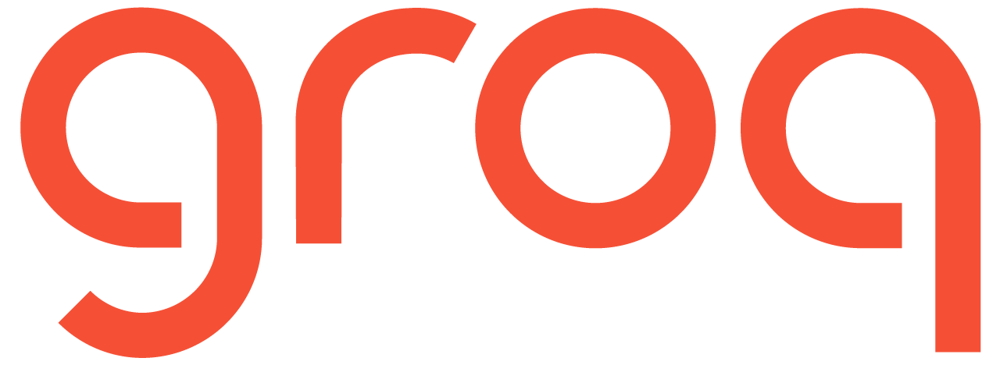

        
    <h1 align="center">📱 Ava 📱</h1>
    <h3 align="center">Turning the Turing Test into a WhatsApp Agent</h3>

    

## Table of Contents

- [Table of Contents](#table-of-contents)
- [Project Overview](#project-overview)
- [Who is this project for?](#who-is-this-project-for)
- [What you'll get out of this project](#what-youll-get-out-of-this-project)
- [Getting started](#getting-started)
- [Tech Stack](#the-tech-stack)
- [License](#license)

## Project Overview

**Ava** is a WhatsApp agent that can engage with users in a "realistic" way, inspired by the film *Ex Machina*. While not a fully sentient robot, Ava will have interesting WhatsApp conversations with users.

By the end of this project, you'll have built your own Ava capable of:

- Receiving and sending WhatsApp messages 📲
- Understanding your voice 🗣️
- Recognizing images 🖼️
- Sending voice notes back 🎤
- Sharing updates about its "daily activities" 🚣
- Sending you images of its current activities 🖼️

> This is a modern reinterpretation of the Turing Test 🤖

## Who is this project for?

This project is aimed at Software Engineers, ML Engineers, and AI Engineers who want to level up by building complex end-to-end apps. It's not just a basic tutorial—it's a deep dive into making a production-ready WhatsApp agent.

## What you'll get out of this project

- Build a fully working WhatsApp agent you can chat with on your phone
- Get a solid understanding of how to build LangGraph workflows
- Set up a long-term memory system using Qdrant as a Vector Database
- Use Groq models to power AI Agent responses
- Implement Speech-to-Text (STT) systems using Whisper
- Implement Text-to-Speech (TTS) systems using ElevenLabs
- Generate high-quality images using diffusion models, like FLUX models
- Process images using Vision Language Models (VLM) like llama-3.2-vision
- Create chat interfaces using Chainlit
- Deploy agentic applications to Cloud Run
- Connect agentic applications to the WhatsApp API

## Getting started

Before you begin, make sure to set up the virtual environment, install dependencies, and create the `.env` file. This setup is critical for the project to run correctly.

> Follow the setup instructions in the [GETTING STARTED.md](docs/GETTING_STARTED.md) document.

## Tech Stack

<table>
  <tr>
    <th>Technology</th>
    <th>Description</th>
  </tr>
  <tr>
    <td></td>
    <td>Powering the project with Llama 3.3, Llama 3.2 Vision, and Whisper. Groq models are fast and efficient.</td>
  </tr>
  <tr>
    <td></td>
    <td>Serving as the long-term database, enabling our agent to recall details shared months ago.</td>
  </tr>
  <tr>
    <td></td>
    <td>Deploying your containers easily to Google Cloud Platform.</td>
  </tr>
  <tr>
    <td></td>
    <td>Build production-ready LangGraph workflows.</td>
  </tr>
  <tr>
    <td></td>
    <td>Amazing TTS models for generating human-like speech.</td>
  </tr>
  <tr>
    <td></td>
    <td>Image generation process powered by Together AI.</td>
  </tr>
</table>

